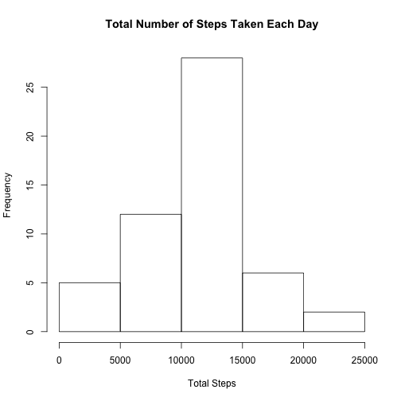
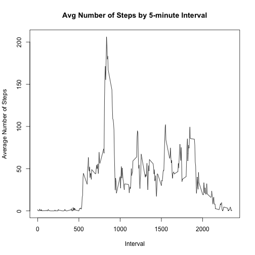
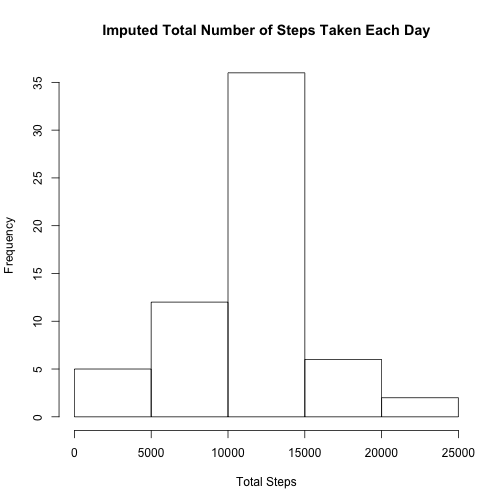
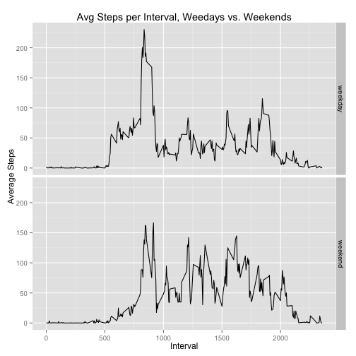

This assignment makes use of data from a personal activity monitoring device. This device collects data at 5 minute intervals through out the day. The data consists of two months of data from an anonymous individual collected during the months of October and November, 2012 and include the number of steps taken in 5 minute intervals each day.

## Loading and preprocessing the data

Activity data was loaded using read.csv function and the date field was converted from string to actual Date class.


```r
activities <- read.csv('./activity.csv')
activities$date <- as.Date(activities$date, format = "%Y-%m-%d")
```


## What is mean total number of steps taken per day?

First, the total number of step taken per day was calculated.

```r
library(dplyr)
stepsday <- group_by(activities, date)
total_steps <- summarize(stepsday, total_steps = sum(steps))
```

Then, an histogram is made with the total steps each interval has to appreciate the frequency.

```r
hist(total_steps$total_steps, main = "Total Number of Steps Taken Each Day", xlab = "Total Steps")
```

 

Finally, the mean and median of the total number of steps taken per day is calculated.

```r
mean(total_steps$total_steps, na.rm = T)
```

```
## [1] 10766.19
```

```r
median(total_steps$total_steps, na.rm = T)
```

```
## [1] 10765
```
The mean is ```10766.19``` while the median is ```10765```.

## What is the average daily activity pattern?

First, the average number of steps taken by 5 minute interval averaged across all days is calculated and plotted.

```r
stepsinterval <- group_by(activities, interval)
avg_interval_steps <- summarize(stepsinterval, avg_steps = mean(steps, na.rm = T))
plot(
    x = avg_interval_steps$interval,
    y = avg_interval_steps$avg_steps,
    type = "l",
    main = "Avg Number of Steps by 5-minute Interval",
    ylab = "Average Number of Steps",
    xlab = "Interval"
)
```

 

To find the 5-minute interval, on average across all the days in the dataset, that contains the maximum number of steps the ```which.max``` function is used.

```r
avg_interval_steps[which.max(avg_interval_steps$avg_steps),]
```

```
## Source: local data frame [1 x 2]
## 
##   interval avg_steps
## 1      835  206.1698
```
It corresponds to the interval ```835```.

## Imputing missing values

First, the total number of missing values in the dataset is calculated.

```r
sum(is.na(activities$steps))
```

```
## [1] 2304
```
There are a total of ```2304``` NA values in the dataset.

Next, all of the missing values in the dataset are filled, the strategy was to use the mean for that 5-minute interval.

```r
activities.imputed <- cbind(activities, avg_interval_steps$avg_steps)
names(activities.imputed) <- c("steps", "date", "interval", "avg_steps")
activities.imputed <- transmute(
    activities.imputed,
    steps = ifelse(is.na(steps),avg_steps, steps),
    date = date,
    interval = interval
)
```

Finally, a new histogram with the total steps for each time interval, as well as the mean and median.

```r
imputed_steps_day <- group_by(activities.imputed, date)
imputed_total_steps <- summarize(imputed_steps_day, total_steps = sum(steps))
hist(imputed_total_steps$total_steps, main = "Imputed Total Number of Steps Taken Each Day", xlab = "Total Steps")
```

 

```r
mean(imputed_total_steps$total_steps)
```

```
## [1] 10766.19
```

```r
median(imputed_total_steps$total_steps)
```

```
## [1] 10766.19
```
The mean and median for the imputed dataset is ```10766.19``` and ```10766.19``` respectively. The was no significant impact to the histogram, mean or median for the imputed dataset.

## Are there differences in activity patterns between weekdays and weekends?

First, a new factor variable in the dataset with two levels – “weekday” and “weekend” indicating whether a given date is a weekday or weekend day is created.

```r
activities.imputed$day_type <- weekdays(activities.imputed$date)
activities.imputed <- transmute(
    activities.imputed,
    steps = steps,
    date = date,
    interval = interval,
    day_type = ifelse(day_type == "Saturday" | day_type == "Sunday", "weekend", "weekday")
)
activities.imputed$day_type <- as.factor(activities.imputed$day_type)
```
Now, to compare activity patterns between weekdays and weekends, a panel plot containing a time series plot of the 5-minute interval (x-axis) and the average number of steps taken, averaged across all weekday days or weekend days (y-axis) is made.

```r
weekdays_steps_interval <- group_by(activities.imputed, interval, day_type)
weekdays_avg_interval_steps <- summarize(weekdays_steps_interval, avg_steps = mean(steps))
library(ggplot2)
qplot(
    interval,
    avg_steps,
    data = weekdays_avg_interval_steps,
    geom = "line",
    facets = day_type ~ .,
    binwidth = 2,
    main = "Avg Steps per Interval, Weedays vs. Weekends",
    xlab = "Interval",
    ylab = "Average Steps"
)
```

 
